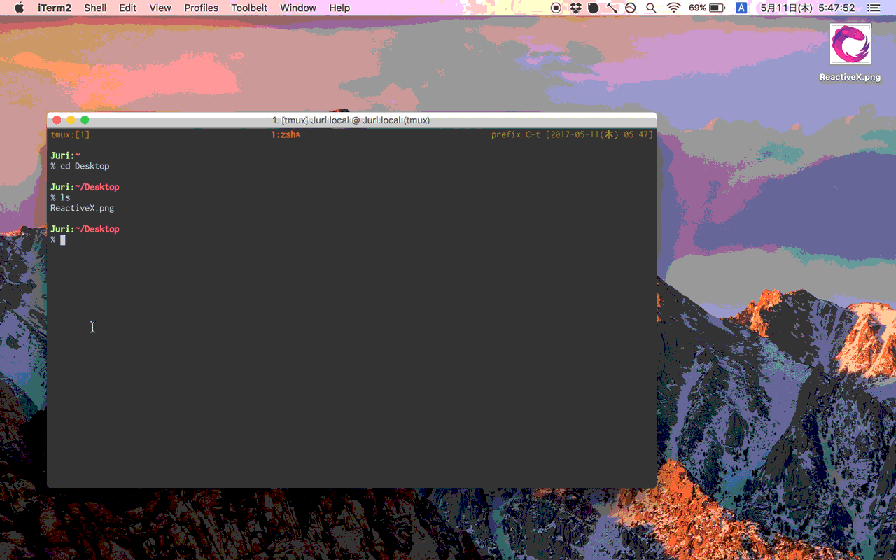

# AppIcon

[](https://travis-ci.org/Nonchalant/AppIcon)

[](https://raw.githubusercontent.com/Nonchalant/AppIcon/master/LICENSE.md)
[](https://github.com/Nonchalant/AppIcon/releases)


[](https://github.com/apple/swift-package-manager)

`AppIcon` generates `*.appiconset` contains each resolution image for iOS, MacOS.

```
AppIcon.appiconset
├── Contents.json
├── AppIcon-20.0x20.0@2x.png
├── AppIcon-20.0x20.0@3x.png
├── AppIcon-29.0x29.0@2x.png
├── AppIcon-29.0x29.0@3x.png
├── AppIcon-40.0x40.0@2x.png
├── AppIcon-40.0x40.0@3x.png
├── AppIcon-60.0x60.0@2x.png
├── AppIcon-60.0x60.0@3x.png
└── AppIcon-1024.0x1024.0@1x.png
```

## Demo



## Installation

### Homebrew

```
$ brew install Nonchalant/appicon/appicon
```

### [Mint](https://github.com/yonaskolb/Mint)

```bash
$ mint run nonchalant/appicon
```

### Manual

Clone the master branch of the repository, then run make install.

```
$ git clone https://github.com/Nonchalant/AppIcon.git
$ make install
```

## Usage

`AppIcon` needs path of base image(`.png`). The size of base image is 1024x1024 pixel preferably.

```
$ appicon iTunesIcon-1024x1024.png
```

## Option

You can see options by `appicon --help`.

#### --icon-name

Default: `AppIcon`

#### --output-path

Default: `./AppIcon.appiconset`

#### --ipad

Default: false

#### --mac

Default: false

## Develop

### Generate Xcode project

```
$ make xcode
```

### Runs debug build

```
$ make debug
```

### Runs release build

```
$ make build
```

### Runs tests

```
$ make test
```

## Author

Takeshi Ihara <afrontier829@gmail.com>

## License

Appicon is available under the MIT license. See the LICENSE file for more info.
